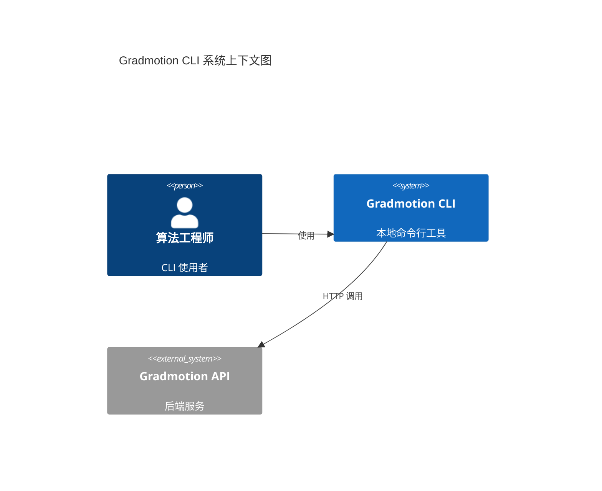
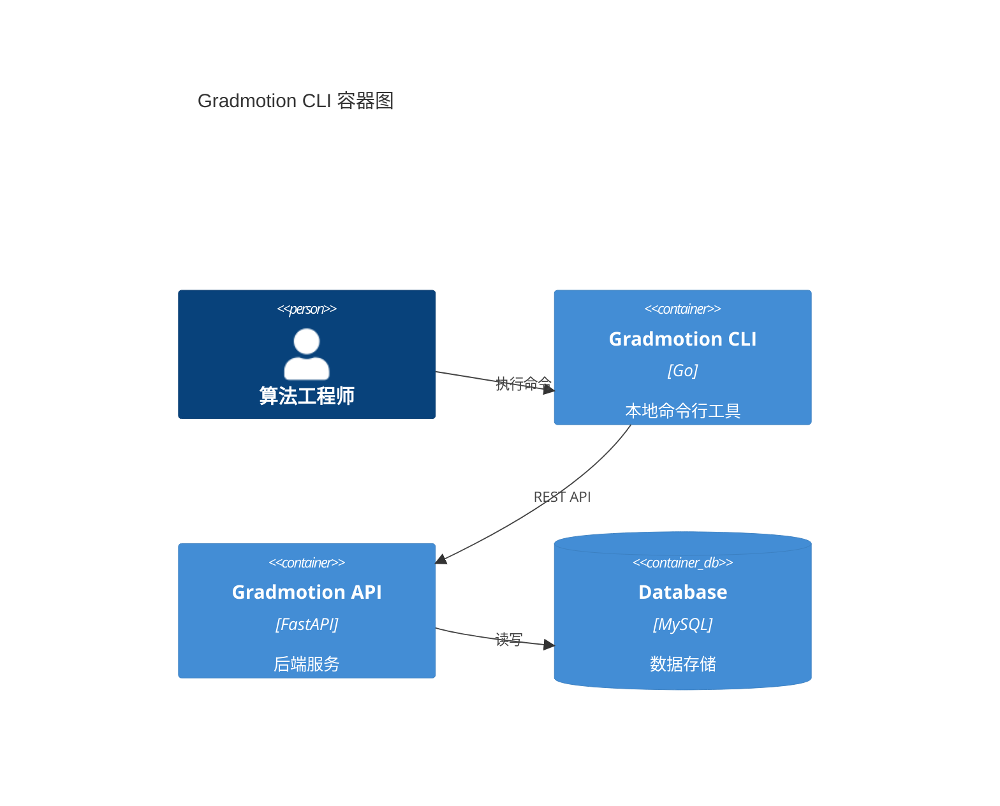

# Gradmotion CLI 技术规格（SPEC）

> 版本：v0.1（草案）  
> 日期：2026-02-09  
> 状态：讨论中  
> 作者：lxt  
> 依据：`docs/prd/cli/Gradmotion-CLI-PRD.md`

---

## 1. 范围与目标

### 1.1 范围
- 仅覆盖 CLI 能力（不包含后端/前端实现）
- MVP 覆盖：`auth / config / task`
- 输出优先面向 Agent/LLM（默认 JSON，结构化日志）

### 1.2 设计目标
- 单一二进制、跨平台（macOS / Linux / Windows）
- API Key 认证，Keychain 默认，配置文件 fallback
- 稳定可解析输出与可观测性字段（默认 JSON）
- 可配置的重试、并发、超时与分页策略

### 1.3 已确认决策
- 技术栈：Go 1.22 + Cobra + Viper + go-keyring + resty + GoReleaser
- 认证头：`X-Api-Key: <api_key>`
- Trace 头：`X-Trace-Id: <uuid>`
- API 前缀：`base_url + /api`
- `auth login` 仅本地保存（不请求后端）
- `auth whoami` 调用后端，`auth status` 仅本地读取
- 默认输出：JSON（stdout）；日志 JSONL（stderr）；`--human` 启用人类可读
- `task logs --follow` 支持轮询刷新，轮询间隔 2s，`--timeout` 控制最大等待
- 默认参数：`timeout=30s`，`retry=3`，`concurrency=4`

---

## 2. 术语
- **Profile**：一组环境配置（base_url / api_key / timeout / retry / concurrency）
- **Trace ID**：由 CLI 生成的请求链路标识（UUID v4）

---

## 3. 技术栈与环境依赖

### 3.1 实现技术栈
- 语言：Go（`go.mod` 约定 `go 1.22`）
- 命令框架：Cobra
- 配置管理：Viper（配置文件 + 环境变量 + flag）
- Keychain：go-keyring
- HTTP Client：resty
- 打包发布：GoReleaser

### 3.2 环境依赖
- Go Toolchain
- Git
- OS Keychain 能力：
  - macOS: Keychain
  - Windows: Credential Manager
  - Linux: Secret Service（缺失则回退配置文件）

---

## 4. 总体架构

### 4.1 组件
- **CLI 命令层**：基于 Cobra 命令树
- **配置层**：Viper 读取 config + env + flags
- **认证层**：go-keyring 与本地配置管理
- **API Client**：统一请求/响应封装、重试、超时、观测字段
- **输出层**：JSON 输出与人类可读输出（`--human`）
- **日志层**：JSONL 结构化日志输出至 stderr

### 4.2 系统上下文图（C4 Level 1）



### 4.3 容器图（C4 Level 2）



---

## 5. 配置与 Profile

### 5.1 配置文件路径
- 默认：`~/.config/gradmotion/config.yaml`
- Windows：`%APPDATA%\gradmotion\config.yaml`

### 5.2 配置结构（YAML）
```yaml
profiles:
  prod:
    base_url: https://spaces.gradmotion.com/prod-api
    api_key: gm_sk_xxx   # 若启用 keychain，可省略或置空
    timeout: 30s
    retry: 3
    concurrency: 4
current: prod
```

### 5.3 优先级
```
CLI flags > 环境变量 > 配置文件
```

### 5.4 环境变量约定
- `GM_BASE_URL`
- `GM_API_KEY`
- `GM_TIMEOUT`
- `GM_RETRY`
- `GM_CONCURRENCY`
- `GM_PROFILE`

---

## 6. 认证与安全

### 6.1 认证方式
- 仅支持 API Key（请求头 `X-Api-Key`）

### 6.2 Key 存储策略
- 默认：系统 Keychain
- Fallback：配置文件（MVP 可明文）
- CLI 需避免在输出中泄露 Key

### 6.3 安全交互
- 高风险操作（`task delete` / `task stop` / batch 操作）需二次确认
- 支持 `--yes` 跳过确认

---

## 7. 输出与日志规范

### 7.1 输出模式
- 默认：JSON 输出（stdout）
- `--human`：人类可读表格
- `--quiet`：仅输出关键字段（JSON 子集）

### 7.2 统一 JSON 结构
```json
{
  "success": true,
  "data": { "items": [] },
  "meta": {
    "trace_id": "req_xxx",
    "request_id": "",
    "duration_ms": 123,
    "command": "gm task list",
    "profile": "prod"
  },
  "error": null
}
```

### 7.3 错误结构
```json
{
  "success": false,
  "data": null,
  "meta": { "trace_id": "req_xxx", "request_id": "" },
  "error": {
    "code": "PERMISSION_DENIED",
    "message": "Permission denied",
    "hint": "检查 API Key 权限"
  }
}
```

### 7.4 日志（stderr，JSONL）
```json
{"level":"info","trace_id":"...","request_id":"","command":"gm task list","endpoint":"/api/task/list","status":200,"duration_ms":123}
```

---

## 8. 退出码规范
- `0`：成功
- `1`：客户端错误（参数/配置）
- `2`：认证失败
- `3`：权限不足
- `4`：网络/超时/重试失败
- `5`：服务端错误

---

## 9. API Client 规范

### 9.1 Base URL
- `base_url` + `/api`

### 9.2 Headers
- `X-Api-Key: <api_key>`
- `X-Trace-Id: <uuid>`
- `User-Agent: gradmotion-cli/<version>`

### 9.3 重试策略
- 默认 3 次重试
- 指数退避：`1s, 2s, 4s`
- 仅对网络异常与 5xx 执行重试

---

## 10. 命令规格（概要）

### 10.1 命令集结构
```
gm
├── auth
│   ├── login
│   ├── logout
│   ├── whoami
│   └── status
├── config
│   ├── set
│   ├── get
│   └── profile
├── task
│   ├── create
│   ├── edit
│   ├── list
│   ├── info
│   ├── run
│   ├── stop
│   ├── restart
│   ├── delete
│   ├── logs
│   ├── params
│   │   ├── submit
│   │   └── update
│   └── batch
│       ├── stop
│       └── delete
├── version
└── help
```

### 10.2 auth
- `gm auth login --api-key <key>`  
  - 行为：写入 keychain 或 config
- `gm auth logout`  
  - 行为：删除 keychain/config 中 key
- `gm auth whoami`  
  - API：`GET /api/user/me`
- `gm auth status`  
  - 行为：读取本地 key 并输出状态（不请求后端）

### 10.3 task
- `gm task create`  
  - API：`POST /api/task/create`
- `gm task edit`  
  - API：`POST /api/task/edit`
- `gm task list`  
  - API：`POST /api/task/list`
  - 参数：`--page/--limit`
- `gm task info`  
  - API：`GET /api/task/info/{task_id}`
- `gm task run`  
  - API：`POST /api/task/run`
- `gm task stop`  
  - API：`POST /api/task/stop`
- `gm task restart`  
  - API：`POST /api/task/restart`
- `gm task delete`  
  - API：`POST /api/task/del`
- `gm task logs`  
  - API：`POST /api/task/console/log`
  - `--follow`：轮询刷新（默认 2s；`--timeout` 控制最大等待）
- `gm task params submit`  
  - API：`POST /api/task/hp/up`
- `gm task params update`  
  - API：`POST /api/task/hp/edit`
- `gm task batch stop`  
  - API：`POST /api/task/batch/stop`
- `gm task batch delete`  
  - API：`POST /api/task/batch/delete`

---

## 11. 项目结构

```
gradmotion-cli/
├── cmd/
│   └── gradmotion/              # 入口命令
├── internal/
│   ├── config/                  # 配置读取与合并
│   ├── auth/                    # keychain 管理
│   ├── client/                  # HTTP client 与重试
│   ├── output/                  # JSON / human 输出
│   ├── log/                     # JSONL 日志
│   └── commands/                # 子命令实现
│       ├── auth/
│       ├── config/
│       └── task/
├── pkg/                         # 可复用工具
├── .goreleaser.yaml
└── go.mod
```

---

## 12. CLI 与 API 映射

| CLI 命令 | API 端点 | 说明 |
|---------|---------|------|
| `gm auth whoami` | `GET /api/user/me` | 获取当前用户 |
| `gm task create` | `POST /api/task/create` | 创建任务 |
| `gm task edit` | `POST /api/task/edit` | 编辑任务 |
| `gm task list` | `POST /api/task/list` | 任务列表 |
| `gm task info` | `GET /api/task/info/{task_id}` | 任务详情/状态 |
| `gm task run` | `POST /api/task/run` | 运行任务 |
| `gm task stop` | `POST /api/task/stop` | 停止任务 |
| `gm task restart` | `POST /api/task/restart` | 继续运行 |
| `gm task delete` | `POST /api/task/del` | 删除任务 |
| `gm task logs` | `POST /api/task/console/log` | 任务日志 |
| `gm task params submit` | `POST /api/task/hp/up` | 提交超参 |
| `gm task params update` | `POST /api/task/hp/edit` | 更新超参 |
| `gm task batch stop` | `POST /api/task/batch/stop` | 批量停止 |
| `gm task batch delete` | `POST /api/task/batch/delete` | 批量删除 |

---

## META（供其他 Skill 解析）

```yaml
project:
  name: gradmotion-cli
  version: "0.1"

tech_stack:
  cli:
    language: Go
    version: "1.22"
    framework: Cobra
    config: Viper
    keyring: go-keyring
    http: resty
    release: GoReleaser

architecture:
  pattern: CLI + API Client
  api_style: RESTful
  auth_method: API Key

modules:
  - name: auth
    type: cli
    priority: P0
    commands:
      - name: login
        method: local
      - name: logout
        method: local
      - name: whoami
        method: GET
        path: /api/user/me
      - name: status
        method: local

  - name: task
    type: cli
    priority: P0
    endpoints:
      - method: POST
        path: /api/task/create
      - method: POST
        path: /api/task/edit
      - method: POST
        path: /api/task/list
      - method: GET
        path: /api/task/info/{task_id}
      - method: POST
        path: /api/task/run
      - method: POST
        path: /api/task/stop
      - method: POST
        path: /api/task/restart
      - method: POST
        path: /api/task/del
      - method: POST
        path: /api/task/console/log
      - method: POST
        path: /api/task/hp/up
      - method: POST
        path: /api/task/hp/edit
      - method: POST
        path: /api/task/batch/stop
      - method: POST
        path: /api/task/batch/delete

environment:
  config_path: ~/.config/gradmotion/config.yaml
  env_vars:
    - GM_BASE_URL
    - GM_API_KEY
    - GM_TIMEOUT
    - GM_RETRY
    - GM_CONCURRENCY
    - GM_PROFILE
```
