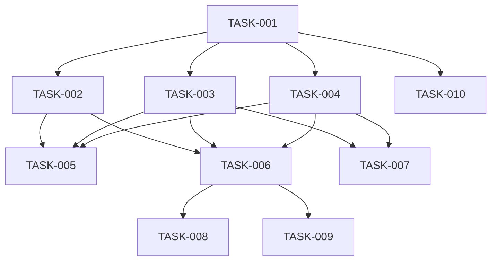

# Gradmotion CLI 开发任务计划

## 元信息
- **PRD**: `docs/prd/cli/Gradmotion-CLI-PRD.md`
- **Spec**: `docs/Gradmotion-CLI-SPEC.md`
- **生成时间**: 2026-02-09
- **任务总数**: 10

---

## 任务依赖图

### Mermaid 视图

### 依赖列表
- TASK-001: 无依赖
- TASK-002: 依赖 [TASK-001]
- TASK-003: 依赖 [TASK-001]
- TASK-004: 依赖 [TASK-001]
- TASK-005: 依赖 [TASK-002, TASK-003, TASK-004]
- TASK-006: 依赖 [TASK-002, TASK-003, TASK-004]
- TASK-007: 依赖 [TASK-003, TASK-004]
- TASK-008: 依赖 [TASK-006]
- TASK-009: 依赖 [TASK-006]
- TASK-010: 依赖 [TASK-001]

---

## 任务列表

### TASK-001: CLI 骨架与命令入口
- **状态**: completed
- **执行者**: codex
- **认领时间**: -
- **优先级**: P0
- **依赖**: 无
- **模块**: 基础设施
- **描述**: 初始化 Go 模块与 Cobra 命令入口，建立基础目录结构。
- **验收标准**:
  - `go mod init` 完成并可构建
  - `gm --help` 输出正常
  - 目录结构符合 Spec 约定
- **相关文件**:
  - `go.mod`
  - `cmd/gradmotion/main.go`
  - `internal/commands/root.go`

### TASK-002: 配置与 Profile 管理
- **状态**: completed
- **执行者**: codex
- **认领时间**: -
- **优先级**: P0
- **依赖**: TASK-001
- **模块**: config
- **描述**: 使用 Viper 实现配置读取、环境变量覆盖与 profile 切换。
- **验收标准**:
  - 支持 `GM_*` 环境变量覆盖
  - 优先级为 flags > env > config
  - 配置路径符合 Spec
- **相关文件**:
  - `internal/config/`
  - `internal/commands/config/`

### TASK-003: API Client 与重试策略
- **状态**: completed
- **执行者**: codex
- **认领时间**: -
- **优先级**: P0
- **依赖**: TASK-001
- **模块**: client
- **描述**: 基于 resty 实现 HTTP 客户端，统一 base_url + /api、重试、超时与公共 Headers。
- **验收标准**:
  - 统一添加 `X-Api-Key` 与 `X-Trace-Id`
  - 重试策略为 3 次指数退避
  - `base_url + /api` 拼接正确
- **相关文件**:
  - `internal/client/`

### TASK-004: 输出与日志层
- **状态**: completed
- **执行者**: codex
- **认领时间**: -
- **优先级**: P0
- **依赖**: TASK-001
- **模块**: output / log
- **描述**: 实现 JSON 输出与 JSONL 日志，支持 `--human` 与 `--quiet`。
- **验收标准**:
  - stdout 结构符合 `success/data/meta/error`
  - stderr 输出 JSONL
  - `--human` 切换为可读表格
- **相关文件**:
  - `internal/output/`
  - `internal/log/`

### TASK-005: auth 命令实现
- **状态**: completed
- **执行者**: codex
- **认领时间**: -
- **优先级**: P0
- **依赖**: TASK-002, TASK-003, TASK-004
- **模块**: auth
- **描述**: 实现 login/logout/status/whoami，login 仅本地保存，whoami 调用 `/api/user/me`。
- **验收标准**:
  - keychain 可用时写入 keychain
  - status 仅本地读取
  - whoami 正确调用 API
- **相关文件**:
  - `internal/auth/`
  - `internal/commands/auth/`

### TASK-006: task 核心命令
- **状态**: completed
- **执行者**: codex
- **认领时间**: -
- **优先级**: P0
- **依赖**: TASK-002, TASK-003, TASK-004
- **模块**: task
- **描述**: 实现 create/edit/list/info/run/stop/restart/delete 命令与参数映射。
- **验收标准**:
  - 命令与 API 映射准确
  - `--page/--limit` 生效
  - 错误输出结构一致
- **相关文件**:
  - `internal/commands/task/`

### TASK-007: task logs + follow
- **状态**: completed
- **执行者**: codex
- **认领时间**: -
- **优先级**: P0
- **依赖**: TASK-003, TASK-004
- **模块**: task
- **描述**: 实现 `task logs` 与 `--follow` 轮询刷新（默认 2s）。
- **验收标准**:
  - `--follow` 按间隔轮询
  - `--timeout` 控制最大等待
- **相关文件**:
  - `internal/commands/task/logs.go`

### TASK-008: task params submit/update
- **状态**: completed
- **执行者**: codex
- **认领时间**: -
- **优先级**: P0
- **依赖**: TASK-006
- **模块**: task params
- **描述**: 实现超参提交与更新命令，支持文件输入。
- **验收标准**:
  - `submit` / `update` 请求体符合后端
  - 文件读取与错误提示明确
- **相关文件**:
  - `internal/commands/task/params.go`

### TASK-009: task batch stop/delete
- **状态**: completed
- **执行者**: codex
- **认领时间**: -
- **优先级**: P0
- **依赖**: TASK-006
- **模块**: task batch
- **描述**: 实现批量停止与批量删除命令。
- **验收标准**:
  - 支持多 task_id 输入
  - 高风险操作需二次确认
- **相关文件**:
  - `internal/commands/task/batch.go`

### TASK-010: 发布与构建配置
- **状态**: completed
- **执行者**: codex
- **认领时间**: -
- **优先级**: P1
- **依赖**: TASK-001
- **模块**: release
- **描述**: 配置 GoReleaser 与构建产物输出。
- **验收标准**:
  - 多平台构建配置完成
  - 产物包含版本号与校验信息
- **相关文件**:
  - `.goreleaser.yaml`

---

## 注意事项
- 任务范围仅限 CLI 侧，不包含后端实现
- API 前缀为 `base_url + /api`
- 认证仅支持 `X-Api-Key`
