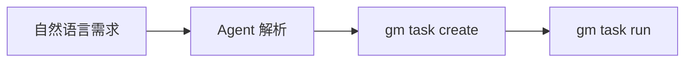
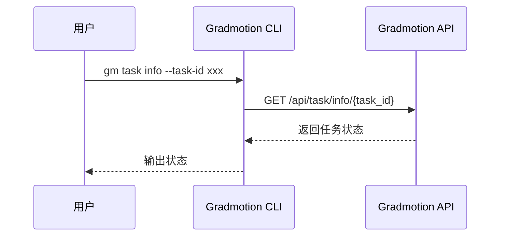
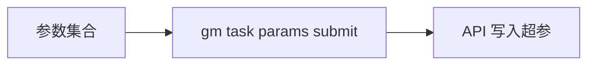
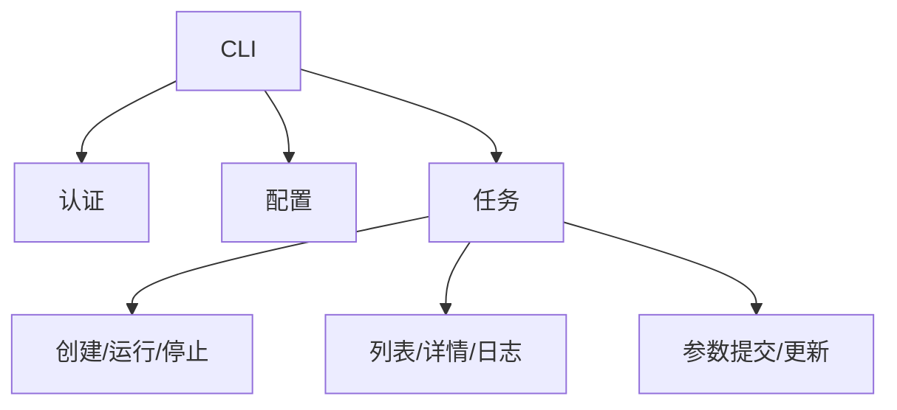

# Gradmotion CLI PRD

> 版本：v0.1（草案）  
> 日期：2026-02-09  
> 状态：讨论中  
> 作者：lxt  

---

## 1. 产品概述

### 1.1 产品愿景
为算法工程师提供一个稳定、可编排的 CLI 入口，使训练任务可被自动化脚本与 Agent 调用，实现“用自然语言驱动训练任务”的基础能力。

### 1.2 目标用户
- 算法工程师

### 1.3 核心价值
通过 CLI 提供训练任务的标准化执行与查询能力，为后续 Agent/自然语言调度提供可靠底座。

---

## 2. 用户故事

### 2.1 算法工程师
- 作为算法工程师，我希望能通过 CLI 创建并运行训练任务，以便快速进入实验迭代。
- 作为算法工程师，我希望能查询训练任务状态与日志，以便及时了解运行情况。
- 作为算法工程师，我希望能批量提交训练参数，以便高效进行多组实验。

---

## 3. 使用场景

### 3.1 自然语言触发训练任务
> 由 Agent 将自然语言解析为具体 CLI 调用（例如创建任务并运行）



### 3.2 查询训练任务状态



### 3.3 批量提交训练参数



---

## 4. 功能需求

### 4.1 核心命令树（MVP，全部 P0）

```
gradmotion
├── auth
│   ├── login
│   ├── logout
│   ├── whoami
│   └── status
├── config
│   ├── set
│   ├── get
│   └── profile
├── task
│   ├── create
│   ├── edit
│   ├── list
│   ├── info
│   ├── run
│   ├── stop
│   ├── restart
│   ├── delete
│   ├── logs
│   ├── params
│   │   ├── submit
│   │   └── update
│   └── batch
│       ├── stop
│       └── delete
├── version
└── help
```

### 4.2 功能清单（按优先级）

| 功能 | 说明 | 优先级 |
|------|------|--------|
| 登录 | 保存 API Key / Token | P0 |
| 配置管理 | 多环境 profile 支持 | P0 |
| 任务创建 | 创建训练任务 | P0 |
| 任务编辑 | 编辑任务配置 | P0 |
| 任务列表 | 列出任务列表 | P0 |
| 任务详情/状态 | 查询任务状态与详情 | P0 |
| 任务运行 | 启动训练任务 | P0 |
| 任务停止 | 停止训练任务 | P0 |
| 任务继续 | 继续运行任务 | P0 |
| 任务删除 | 删除任务 | P0 |
| 任务日志 | 查询任务日志 | P0 |
| 训练参数提交 | 批量提交训练超参 | P0 |
| 训练参数更新 | 更新已提交超参 | P0 |
| 批量停止 | 批量停止任务 | P0 |
| 批量删除 | 批量删除任务 | P0 |

---

## 5. 交互设计

### 5.1 输出格式
- 默认输出 JSON（stdout），便于 Agent 解析
- 日志输出到 stderr，便于脚本重定向
- 支持 `--human` 人类可读输出（表格）

### 5.2 示例

```bash
# 登录
gm auth login --api-key gm_sk_xxx

# 创建任务
gm task create --name "exp-001" --project-id prj_xxx

# 运行任务
gm task run --task-id task_xxx

# 查看状态
gm task info --task-id task_xxx

# 提交训练参数
gm task params submit --task-id task_xxx --file ./params.yaml
```

---

## 6. 权限与安全

### 6.1 认证方式
- 仅支持 API Key 认证（`X-Api-Key`）
- 权限继承用户角色

### 6.2 Key 存储策略
- 优先使用系统 Keychain
- Fallback：本地配置文件（可选加密）

### 6.3 环境隔离与保护
- 支持多 Profile（dev/test/prod）
- 高风险操作默认二次确认（如 delete/stop）

---

## 7. 非功能需求

### 7.1 性能要求
- 任务列表查询 < 2s

### 7.2 可靠性
- 关键操作失败自动重试（可配置）

### 7.3 兼容性要求
- macOS / Linux / Windows

### 7.4 可观测性
- 结构化日志（JSONL）
- 标准化错误码与可执行提示
- CLI 生成 `trace_id` 并通过 `X-Trace-Id` 传递

---

## 8. 不做什么（Out of Scope）

当前版本暂无明确排除项。

---

## 9. 信息架构



---

## 10. 约束与假设

### 10.1 约束条件
- 依赖现有 Gradmotion API 能力
- 任务相关接口与权限策略保持一致
- API 前缀规则：`base_url + /api`

### 10.2 假设前提
- 后端已提供可稳定调用的任务接口
- 用户已具备有效的 API Key

---

## 11. CLI 与 API 映射（任务核心）

| CLI 命令 | API 端点 | 说明 |
|---------|---------|------|
| `gm auth whoami` | `GET /api/user/me` | 获取当前用户 |
| `gm task create` | `POST /api/task/create` | 创建任务 |
| `gm task edit` | `POST /api/task/edit` | 编辑任务 |
| `gm task list` | `POST /api/task/list` | 任务列表 |
| `gm task info` | `GET /api/task/info/{task_id}` | 任务详情/状态 |
| `gm task run` | `POST /api/task/run` | 运行任务 |
| `gm task stop` | `POST /api/task/stop` | 停止任务 |
| `gm task restart` | `POST /api/task/restart` | 继续运行 |
| `gm task delete` | `POST /api/task/del` | 删除任务 |
| `gm task logs` | `POST /api/task/console/log` | 任务日志 |
| `gm task params submit` | `POST /api/task/hp/up` | 提交超参 |
| `gm task params update` | `POST /api/task/hp/edit` | 更新超参 |
| `gm task batch stop` | `POST /api/task/batch/stop` | 批量停止 |
| `gm task batch delete` | `POST /api/task/batch/delete` | 批量删除 |

---

## 12. 验收标准

- [ ] CLI 可登录并保存 API Key
- [ ] 可创建并运行训练任务
- [ ] 可查询任务列表、详情与状态
- [ ] 可提交与更新训练参数
- [ ] 可查看任务日志
- [ ] 批量停止/删除可用
- [ ] JSON 输出格式稳定，可被 Agent 解析

---

## META（供其他 Skill 解析）

```yaml
product:
  name: gradmotion-cli
  version: "0.1"

modules:
  - name: auth
    priority: P0
    features:
      - name: login
        priority: P0
        description: 保存 API Key / Token
      - name: logout
        priority: P0
        description: 清除本地认证信息
      - name: whoami
        priority: P0
        description: 获取当前身份信息
      - name: status
        priority: P0
        description: 查看认证状态

  - name: config
    priority: P0
    features:
      - name: set
        priority: P0
        description: 设置配置项
      - name: get
        priority: P0
        description: 读取配置项
      - name: profile
        priority: P0
        description: 管理多环境配置

  - name: task
    priority: P0
    features:
      - name: create
        priority: P0
        description: 创建训练任务
      - name: edit
        priority: P0
        description: 编辑训练任务
      - name: list
        priority: P0
        description: 任务列表
      - name: info
        priority: P0
        description: 任务详情/状态
      - name: run
        priority: P0
        description: 启动任务
      - name: stop
        priority: P0
        description: 停止任务
      - name: restart
        priority: P0
        description: 继续运行
      - name: delete
        priority: P0
        description: 删除任务
      - name: logs
        priority: P0
        description: 任务日志
      - name: params_submit
        priority: P0
        description: 提交训练超参
      - name: params_update
        priority: P0
        description: 更新训练超参
      - name: batch_stop
        priority: P0
        description: 批量停止
      - name: batch_delete
        priority: P0
        description: 批量删除

out_of_scope: []

non_functional:
  performance:
    - 任务列表查询 < 2s
  security:
    - API Key / Token 鉴权
  compatibility:
    - macOS
    - Linux
    - Windows
```
