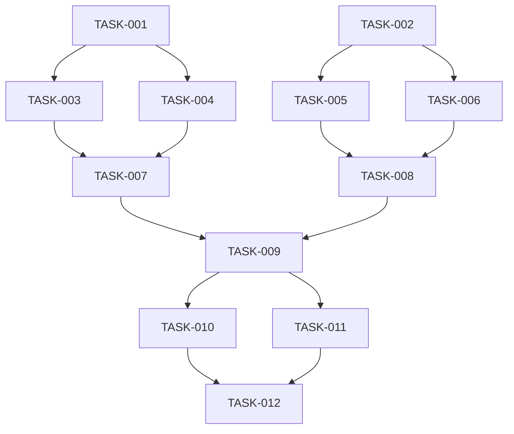

# Gradmotion CLI 训练任务 MVP 增量开发计划

## 元信息
- **PRD**: `docs/mvp-add-prd.md`
- **接口清单**: `task-mvp-add.md`
- **生成时间**: 2026-03-02
- **范围**: 基于现有 `gm task` 能力，补齐“新建仿真训练更好用”的 CLI 命令与接口映射
- **任务总数**: 12

## 模块拆分
- **M0 路径策略兼容**: CLI 绝对路径模式（不自动追加 `/api`）
- **M1 项目域能力**: `project list/create/info`
- **M2 任务扩展命令骨架**: `task copy/resource/image/storage/data/hp/env`
- **M3 新建训练前置选择**: 算力资源、镜像、个人存储路径、提醒参数透传
- **M4 训练观测与结果**: 图表 key/data/download、运行环境、超参读取
- **M5 质量与文档**: 帮助文案、示例、回归验证

## 任务依赖图

### Mermaid

### 依赖列表
- `TASK-001`: 无依赖
- `TASK-002`: 无依赖
- `TASK-003`: 依赖 `TASK-001`
- `TASK-004`: 依赖 `TASK-001`
- `TASK-005`: 依赖 `TASK-002`
- `TASK-006`: 依赖 `TASK-002`
- `TASK-007`: 依赖 `TASK-003`, `TASK-004`
- `TASK-008`: 依赖 `TASK-005`, `TASK-006`
- `TASK-009`: 依赖 `TASK-007`, `TASK-008`
- `TASK-010`: 依赖 `TASK-009`
- `TASK-011`: 依赖 `TASK-009`
- `TASK-012`: 依赖 `TASK-010`, `TASK-011`

## 任务列表

### TASK-001: 新增 project 命令入口
- **状态**: pending
- **优先级**: P0
- **模块**: M1 项目域能力
- **描述**: 新建 `internal/commands/project` 包并接入根命令，提供命令骨架。
- **接口/命令**: `gm project`
- **验收标准**:
  - `gm --help` 可见 `project`
  - `gm project --help` 展示子命令占位
- **相关文件**: `internal/commands/root.go`, `internal/commands/project/project.go`

### TASK-002: task 扩展子命令骨架
- **状态**: pending
- **优先级**: P0
- **模块**: M2 任务扩展命令骨架
- **描述**: 为现有 `task` 增加子命令分组（resource/image/storage/data/hp/env/copy）。
- **接口/命令**:
  - `gm task copy`
  - `gm task resource list`
  - `gm task image official list|personal list|versions`
  - `gm task storage list`
  - `gm task data keys|get|download`
  - `gm task hp get`
  - `gm task env get`
- **验收标准**:
  - 新子命令均可 `--help`
  - 不影响既有 `create/edit/list/info/run/stop/delete/logs/params/batch`
- **相关文件**: `internal/commands/task/task.go`

### TASK-003: 实现绝对路径模式 + project list/create/info
- **状态**: pending
- **优先级**: P0
- **模块**: M0 路径策略兼容, M1 项目域能力
- **描述**: 新增 CLI 绝对路径模式（不自动追加 `/api`），并调通项目域接口，支持 `--data/--file` 与基础 flag。
- **接口/命令**:
  - `POST /project/list` -> `gm project list`
  - `POST /project/create` -> `gm project create`
  - `GET /project/info/{projectId}` -> `gm project info --project-id`
- **验收标准**:
  - 当 endpoint 以绝对路径模式调用时，不自动拼接 `/api`
  - 相对路径仍保持现有行为（`/api + endpoint`）
  - 返回 envelope 格式一致
  - 参数缺失有本地可读错误提示
- **相关文件**: `internal/client/client.go`, `internal/commands/project/project.go`, `internal/commands/shared/context.go`

### TASK-004: 实现 task copy
- **状态**: pending
- **优先级**: P0
- **模块**: M2 任务扩展命令骨架
- **描述**: 增加任务复制命令，支持 `--data/--file`。
- **接口/命令**: `POST /task/copy` -> `gm task copy`
- **验收标准**:
  - 可通过 JSON 文件复制任务
  - 返回新 `taskId`
- **相关文件**: `internal/commands/task/task.go`

### TASK-005: 实现资源与镜像查询命令
- **状态**: pending
- **优先级**: P0
- **模块**: M3 新建训练前置选择
- **描述**: 落地“算力资源 + 镜像”查询能力，服务创建前参数准备。
- **接口/命令**:
  - `GET /task/goods/list-by-category` -> `gm task resource list`
  - `GET /images/official/list` -> `gm task image official list`
  - `GET /images/personal/list` -> `gm task image personal list`
  - `GET /task/getImageVersion` -> `gm task image versions`
- **验收标准**:
  - `gm task resource list` 参数与后端对齐：`goodsBackCategory`（必填）、`pageNum`、`pageSize`
  - 支持筛选参数透传
  - 人类模式可读（资源名、价格、镜像版本）
- **相关文件**: `internal/commands/task/task.go`

### TASK-006: 实现个人存储路径查询命令
- **状态**: pending
- **优先级**: P0
- **模块**: M3 新建训练前置选择
- **描述**: 增加 `gm task storage list`，调用 GM 前缀存储接口用于挂载路径选择（使用绝对路径模式）。
- **接口/命令**: `GET /gm/storage/list`（绝对路径模式） -> `gm task storage list`
- **验收标准**:
  - 参数与后端对齐为 `folderPath`
  - 输出可直接复制用于 `taskBaseInfo.personalDataPath`
- **相关文件**: `internal/commands/task/task.go`

### TASK-007: 新建训练 payload 模板与提醒参数规范
- **状态**: pending
- **优先级**: P1
- **模块**: M3 新建训练前置选择
- **描述**: 在文档与 help 中给出创建 payload 模板，包含 `goodsId`、`personalDataPath`、`runtimeReminderConfig`。
- **接口/命令**: `POST /task/create`（现有命令增强）
- **验收标准**:
  - 提供最小可运行 payload 示例
  - 提供提醒配置字段示例（开启/关闭）
- **相关文件**: `docs/gradmotion-cli-task.md`, `docs/mvp-add-prd.md`

### TASK-008: 实现 data/hp/env 查询命令
- **状态**: pending
- **优先级**: P1
- **模块**: M4 训练观测与结果
- **描述**: 补齐图表、超参、运行环境读取能力。
- **接口/命令**:
  - `GET /task/data/keys/{taskId}` -> `gm task data keys`
  - `POST /task/data/info` -> `gm task data get`
  - `GET /task/data/download/{taskId}` -> `gm task data download`
  - `GET /task/hp/info/{taskId}` -> `gm task hp get`
  - `GET /task/run/env/{taskId}` -> `gm task env get`
- **验收标准**:
  - 支持单任务与 key 维度查询
  - `data download` 输出下载地址或文件结果
- **相关文件**: `internal/commands/task/task.go`

### TASK-009: 命令参数一致性与风险防护
- **状态**: pending
- **优先级**: P1
- **模块**: M5 质量与文档
- **描述**: 统一新命令 flag 风格、错误码、危险操作确认策略。
- **验收标准**:
  - 统一 `--task-id/--project-id/--data/--file` 与查询参数命名
  - `task resource list` 与 `task storage list` 参数命名与后端保持一致（`goodsBackCategory/pageNum/pageSize/folderPath`）
  - 高风险命令默认确认，`--yes` 可跳过
- **相关文件**: `internal/commands/task/task.go`, `internal/commands/project/project.go`

### TASK-010: 集成测试用例（happy path）
- **状态**: pending
- **优先级**: P1
- **模块**: M5 质量与文档
- **描述**: 增加最小回归脚本，覆盖“项目->创建训练->运行->日志->停止”链路。
- **验收标准**:
  - 命令链路可串行跑通
  - 失败信息可定位接口或参数问题
- **相关文件**: `scripts/`（新增测试脚本）, `docs/`

### TASK-011: 文档与示例更新
- **状态**: pending
- **优先级**: P1
- **模块**: M5 质量与文档
- **描述**: 更新 task/project 使用文档与示例 JSON。
- **验收标准**:
  - 每个新增命令均有示例
  - 包含“你强调的三点”实操示例
- **相关文件**: `docs/gradmotion-cli-task.md`, `docs/mvp-add-prd.md`, `docs/task-plan-mvp-add.md`

### TASK-012: 发布前检查与验收
- **状态**: pending
- **优先级**: P0
- **模块**: M5 质量与文档
- **描述**: 汇总验收、检查帮助文案、确认命令兼容性。
- **验收标准**:
  - 新增命令 `--help` 完整
  - 旧命令行为无回归
  - MVP 验收项全部通过
- **相关文件**: 全局

## 建议执行顺序（两轮）
- **第一轮（P0）**: `TASK-001` `TASK-002` `TASK-003` `TASK-004` `TASK-005` `TASK-006` `TASK-012`
- **第二轮（P1）**: `TASK-007` `TASK-008` `TASK-009` `TASK-010` `TASK-011`

## 检查点
- **Checkpoint A（第一轮结束）**:
  - 项目命令可用
  - 绝对路径模式可用（`/gm/*` 不自动拼接 `/api`）
  - 三个必需点（算力资源/提醒配置透传/个人存储路径）可支撑创建流程
- **Checkpoint B（第二轮结束）**:
  - 图表、超参、运行环境命令可用
  - 文档可直接指导用户完成完整链路
